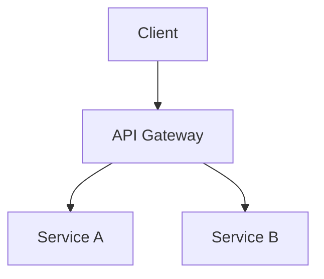
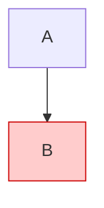
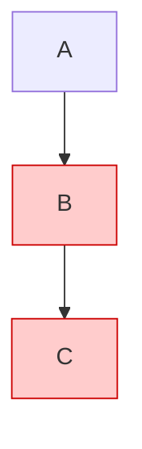
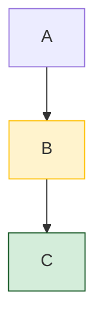

# Article Generator

## Overview

Generate detailed, well-structured articles from raw information using a **TOC-first, enrich-second** approach. Every article must pass through three phases: understand information points, generate structure, then write with diagrams and tables. Core principle: **图表优先，文字辅助，颜色点睛。**

## When to Use

- Given raw information/copy and asked to produce an article
- Given a topic with existing knowledge and need to generate documentation
- Turning notes, outlines, or bullet points into a full article
- Creating blog posts or technical docs from source material

**When NOT to use:**
- Editing/refining an existing article (use direct editing)
- Writing code documentation from code (use code analysis tools)
- Summarizing (that's a different task)

## Core Process

### Phase 1: Understand Each Information Point

Before writing anything, process each piece of raw information individually:

1. List every information point from the source material
2. For each point, identify:
   - What it means (core concept)
   - Why it matters (significance)
   - How it relates to other points (connections)
3. Flag points that would benefit from a diagram or table

**Output:** A numbered list of processed information points with tags like `[diagram]`, `[table]`, `[example]`.

### Phase 2: Generate TOC First

Create a table of contents BEFORE writing any content:

1. Group related information points into logical sections
2. Order sections for natural reading flow (intro → concepts → details → summary)
3. Show the TOC to the user and wait for confirmation
4. Adjust based on feedback

**TOC format:**
```
## 目录
1. 引言 - [brief description]
2. [Section] - [what it covers]
   - 2.1 [Subsection]
   - 2.2 [Subsection]
3. [Section] - [what it covers]
...
N. 总结 - [what it covers]
```

### Phase 3: Write with Rich Content

Write each section with these requirements:

#### 图表优先原则

**核心理念：能用图表达的不用文字，能用表格对比的不用段落。** 读者扫一眼图/表获取的信息量，远超读一大段文字。

**优先级顺序：**
1. 能画图的 → 用 Mermaid 图（架构、流程、关系、时序）
2. 能对比/列举的 → 用表格（工具对比、方案选型、特征矩阵）
3. 必须文字描述的 → 配上图或表辅助理解

**每篇文章至少 2 个图 + 1 个表。** 图表不是装饰，是主要的信息载体。

#### Diagrams (Mandatory)

**At least 1 Mermaid diagram per article.** Use diagrams when:
- Showing architecture or system structure → flowchart/graph
- Showing process flow → flowchart
- Showing state transitions → stateDiagram
- Showing sequence of interactions → sequenceDiagram
- Showing component relationships → graph
- Comparing concepts visually → graph with classDef styling

**Mermaid syntax reference:**
````markdown

````

**⚠️ Mermaid 样式语法（Docusaurus 兼容）：**

**绝对禁止** 使用 `style` 指令直接设置节点样式——在 Docusaurus/React 环境下会报错：
`The style prop expects a mapping from style properties to values, not a string.`

错误写法 ❌：


正确写法 ✅ — 使用 `classDef` + `:::` 语法：


多个节点共享同一样式：


多个样式类：


**When to use which diagram type:**

| Scenario | Diagram Type |
|----------|-------------|
| System architecture | `graph TD` or `graph LR` |
| Request flow through services | `sequenceDiagram` |
| State machine / lifecycle | `stateDiagram-v2` |
| Decision process | `flowchart TD` |
| Timeline / phases | `timeline` |
| Entity relationships | `erDiagram` |

#### Tables (Mandatory)

**At least 1 comparison/summary table per article.** Use tables when:
- Comparing tools, technologies, or approaches
- Listing options with their characteristics
- Summarizing key points
- Showing before/after or pros/cons

**Table patterns:**
- Comparison table: columns for each option, rows for attributes
- Summary table: columns for category and solution
- Feature matrix: columns for features, rows for implementations

#### 图文配合（图表 + 文字解释）

**每个图表前后必须有文字解释，不能只放一个图就完事。**

**模式 1：先文后图（推荐）**
> 文字引出问题或概念 → 图/表展示全貌 → 文字补充细节

```markdown
RAG 系统在三个环节可能出错：检索、生成、端到端。

[插入三层评测体系图]

从图中可以看出，第一层关注组件级表现，第二层关注链路质量，
第三层才落到业务指标。下面逐层展开。
```

**模式 2：先图后文**
> 图/表快速呈现 → 文字解读关键点

```markdown
[插入对比表]

从表中可以看出，RAGAS 最轻量适合快速验证，
DeepEval 更适合 CI 集成，TruLens 偏向生产监控。
```

**反模式（禁止）：**
- ❌ 只放图表，没有任何文字说明
- ❌ 图表和正文脱节，图表是"装饰"
- ❌ 文字重复图表中已经明确的信息（图说过的不用再写一遍）

#### Markdown 语法运用

生成文章时，充分利用 Markdown 语法增强可读性和层次感：

- **标题层级**：用 `#` / `##` / `###` 建立清晰的文档结构，避免超过 4 层嵌套
- **加粗**：关键术语首次出现时加粗，重要结论加粗强调
- **斜体**：补充说明、引入新概念、或轻微强调时使用
- **引用块** (`>`)：用于名人名言、核心观点提炼、重要结论突出
- **代码块**：行内代码用于标记函数名、变量名、命令；代码块用于展示示例代码或配置
- **列表**：有序列表用于步骤流程，无序列表用于并列要点

原则：**让读者一眼扫到重点，而不是在大段文字里找信息。**

#### 字体颜色（CSS 类）

重点段落或关键词可以用 `<span className="...">` 添加字体色，帮助读者快速定位核心信息。

**⚠️ Docusaurus/MDX 禁止使用 `<span style="color:...">` 语法**——React 会报错：
`The style prop expects a mapping from style properties to values, not a string.`

必须使用 CSS 类名。项目中已预定义以下工具类（见 `src/css/custom.css`）：

| 颜色 | 用途 | 代码 |
|------|------|------|
| 红色 | 警告、错误、易错点 | `<span className="text-red">` |
| 蓝色 | 核心概念、重点强调 | `<span className="text-blue">` |
| 绿色 | 正确做法、推荐方案 | `<span className="text-green">` |
| 橙色 | 注意事项、补充说明 | `<span className="text-orange">` |
| 紫色 | 高级技巧、加分项 | `<span className="text-purple">` |

**使用原则：**
- 不要滥用，一篇文章中颜色标记不超过 5-8 处
- 只用于真正需要突出的关键句、结论、易错点
- 颜色标记配合加粗一起使用效果更好：**<span className="text-red">这是一个关键警告</span>**
- 避免用颜色 alone 传递信息（考虑色盲读者），颜色是辅助，文字才是主体

#### Content Depth

Each section should:
- Explain the concept clearly (not just mention it)
- Provide concrete examples where applicable
- Connect to other sections (show relationships)
- Use bold for key terms on first introduction

## Output Structure

```markdown
# [Title]

## 引言
[Context and motivation - why this topic matters]

## 目录
[Generated TOC]

[Section 1 with diagram/table as appropriate]

[Section 2...]

...

## 总结
[Key takeaways, summary table of main points]
```

## Common Mistakes

| Mistake | Fix |
|---------|-----|
| Skipping TOC, jumping to writing | Always generate TOC first, get confirmation |
| No diagrams in technical articles | Every architecture/process needs a diagram |
| 只放图表没有文字解释 | 每个图表前后必须有文字引出或解读 |
| 大段文字能用图/表代替的 | 图表优先：能画图的不写段落，能列表的不写长句 |
| 颜色标记滥用或完全不用 | 重点句用颜色（≤8处），不用则读者扫不到重点 |
| Only using bullet points | Mix prose, diagrams, and tables |
| Generic section names | Use descriptive names: "断路器模式——防止级联故障" not "容错机制" |
| Ignoring relationships between info points | Explicitly connect related concepts |
| Writing too briefly per section | Each section should be self-contained and detailed |
| No summary table at the end | Always end with a structured summary |
| Mermaid 中使用 `style` 指令 | Docusaurus 下会报 React style prop 错误，必须用 `classDef` + `:::` 语法替代 |
| 文本中使用 `<span style="color:...">` | Docusaurus/MDX 下 React 会报错，必须用 `<span className="text-red">` 等 CSS 类 |

## Example: Information Processing

**Raw info:** "API Gateway handles routing, aggregation, and protocol conversion."

**Processed:**
```
Point 3: API Gateway职责
- Core: 统一入口点，处理请求路由、响应聚合、协议转换
- Significance: 解决客户端直接调用多服务的复杂性
- Related to: 微服务拆分（point 1）、服务发现（point 5）
- Tag: [diagram] — show request flow through gateway
- Tag: [table] — list gateway solutions (Kong, Spring Cloud Gateway, Nginx)
```

## Checklist

Before submitting the article, verify:
- [ ] Each raw information point is understood and addressed
- [ ] TOC was generated and confirmed before writing
- [ ] At least 2 Mermaid diagrams present（图表优先，不是装饰）
- [ ] At least 1 comparison/summary table present (beyond summary)
- [ ] 每个图表前后都有文字解释（图文配合）
- [ ] Summary section has a structured table
- [ ] Key terms are bolded on first use
- [ ] 重点句/结论使用了字体颜色标记（不超过 5-8 处）
- [ ] 使用了引用块、代码块、列表等多种 Markdown 语法（不只是纯文本段落）
- [ ] Sections connect to each other (not isolated paragraphs)
- [ ] Content is detailed enough to be self-explanatory
- [ ] 能用图表达的内容没有用大段文字代替
- [ ] Mermaid 图中未使用 `style` 指令（使用 `classDef` + `:::` 代替）
- [ ] 文本中未使用 `<span style="color:...">`（使用 `<span className="text-*">` 代替）
