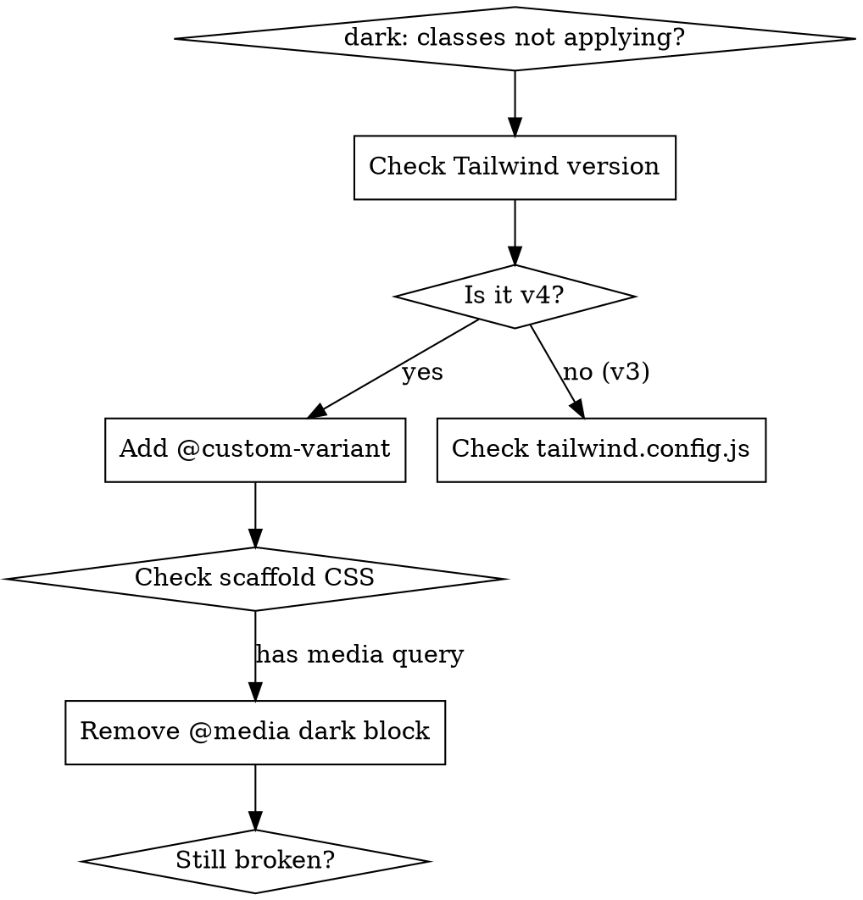

# Fix Tailwind CSS v4 Dark Mode

## Overview

Tailwind CSS v4 uses CSS-first configuration and defaults to `prefers-color-scheme` media query for `dark:` variants. The v3 `darkMode: "class"` setting in `tailwind.config.js` is **ignored**. Class-based dark mode requires an explicit `@custom-variant` directive.

## Diagnosis



**Quick check:** Inspect a `dark:bg-*` element in dev tools. If styles show `@media (prefers-color-scheme: dark)` instead of `.dark &`, Tailwind is in media-query mode.

## Fix

### Step 1: Enable class-based dark mode

Add to `src/index.css` (or equivalent entry CSS):

```css
@import "tailwindcss";
@custom-variant dark (&:where(.dark, .dark *));
```

### Step 2: Remove conflicting scaffold CSS

Delete any `@media (prefers-color-scheme: dark)` blocks from scaffold files (e.g., `App.css` from Tauri/Vite scaffolds). These override Tailwind's `dark:` utilities independently of the `.dark` class.

### Step 3: Persist theme preference

In `main.tsx` (before React mounts, prevents FOUC):

```tsx
const savedTheme = localStorage.getItem("theme");
if (
  savedTheme === "dark" ||
  (!savedTheme && window.matchMedia("(prefers-color-scheme: dark)").matches)
) {
  document.documentElement.classList.add("dark");
}
```

In `App.tsx` (toggle + persist):

```tsx
const [dark, setDark] = useState(() => document.documentElement.classList.contains("dark"));

const toggleDark = () => {
  setDark((d) => {
    const next = !d;
    document.documentElement.classList.toggle("dark", next);
    localStorage.setItem("theme", next ? "dark" : "light");
    return next;
  });
};
```

### Step 4: Delete unused config

Remove `tailwind.config.js` if its only purpose was `darkMode: "class"`. Tailwind v4 auto-detects content paths.

## Quick Reference

| Symptom | Cause | Fix |
|---------|-------|-----|
| Toggle adds `.dark` but no style change | v4 defaults to media query mode | `@custom-variant dark (&:where(.dark, .dark *));` |
| Dark mode works but reverts on reload | No persistence | Save to `localStorage` in toggle handler |
| Flash of wrong theme on load | Theme set too late | Set class in `main.tsx` before `ReactDOM.createRoot` |
| Some elements ignore toggle | Scaffold `@media` override | Remove `@media (prefers-color-scheme: dark)` block |
| `tailwind.config.js` `darkMode` has no effect | v4 ignores JS config for dark mode | Use CSS `@custom-variant` instead |

## Common Mistakes

- **Using `darkMode: "class"` in `tailwind.config.js`** — v3 pattern, ignored by v4
- **Setting theme only in React state** — too late, causes FOUC. Set in `main.tsx` before mount
- **Keeping scaffold `@media` blocks** — they override Tailwind regardless of `.dark` class
- **Using `@config` to load `tailwind.config.js`** — works but is the v3 compatibility path. Prefer CSS-native `@custom-variant`
