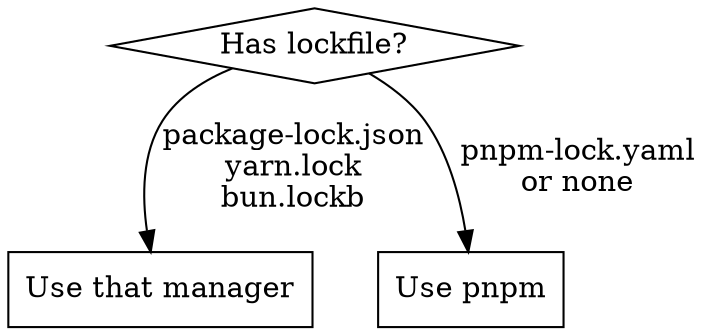

# Prefer pnpm

## Overview

Always use `pnpm` as the default Node.js package manager. Only fall back to `npm` or `yarn` when the project explicitly requires it.

## Decision Flow

## Quick Reference

| Task | Command |
|------|---------|
| Install all deps | `pnpm install` |
| Add dependency | `pnpm add <pkg>` |
| Add dev dependency | `pnpm add -D <pkg>` |
| Remove dependency | `pnpm remove <pkg>` |
| Run script | `pnpm run <script>` or `pnpm <script>` |
| Execute binary | `pnpm exec <cmd>` or `pnpx <cmd>` |
| Update deps | `pnpm update` |
| Why is dep installed | `pnpm why <pkg>` |

## Rules

1. **Default to pnpm** for all package operations
2. **Respect existing lockfiles** — if `package-lock.json` or `yarn.lock` exists, use the corresponding manager
3. **Don't mix managers** — never run `npm install` in a pnpm project or vice versa
4. **Use `pnpm dlx`** instead of `npx` for one-off executions
5. **Workspace support** — use `pnpm -w` flag for monorepo root operations

## Common Mistakes

- Using `npx` instead of `pnpm dlx` — always prefer the pnpm equivalent
- Running `npm install` after cloning a pnpm project — check for `pnpm-lock.yaml` first
- Forgetting `-w` flag in monorepos — `pnpm add -w <pkg>` to install at root

test line
